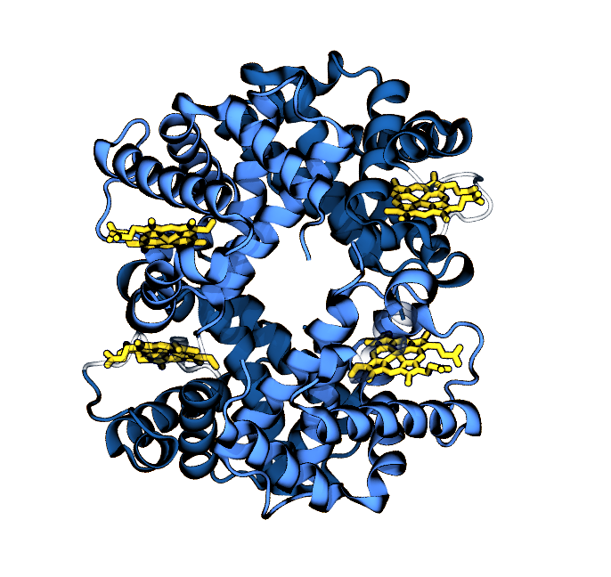
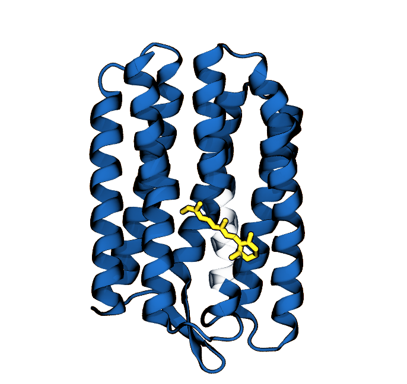
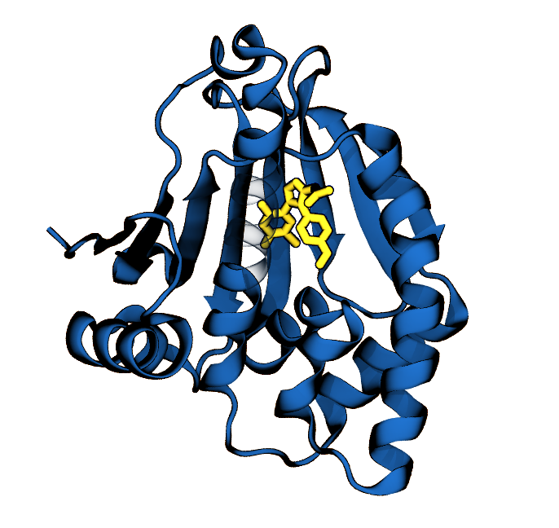
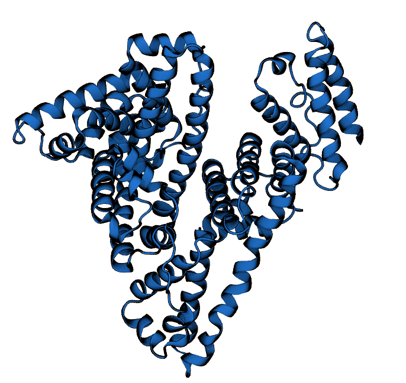
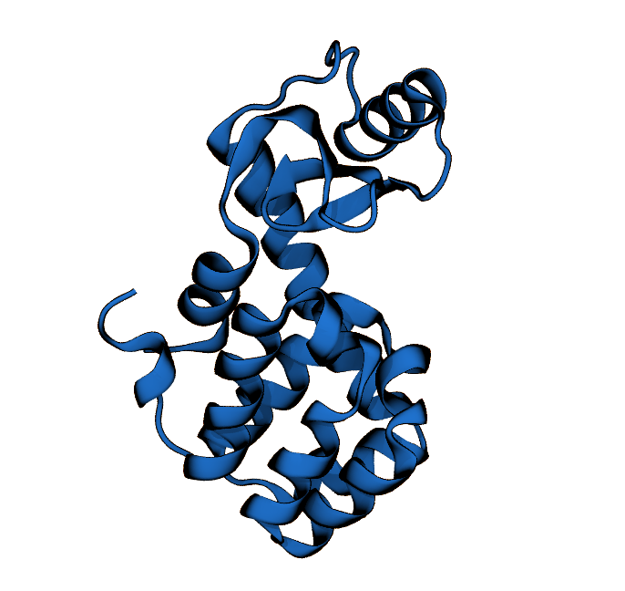
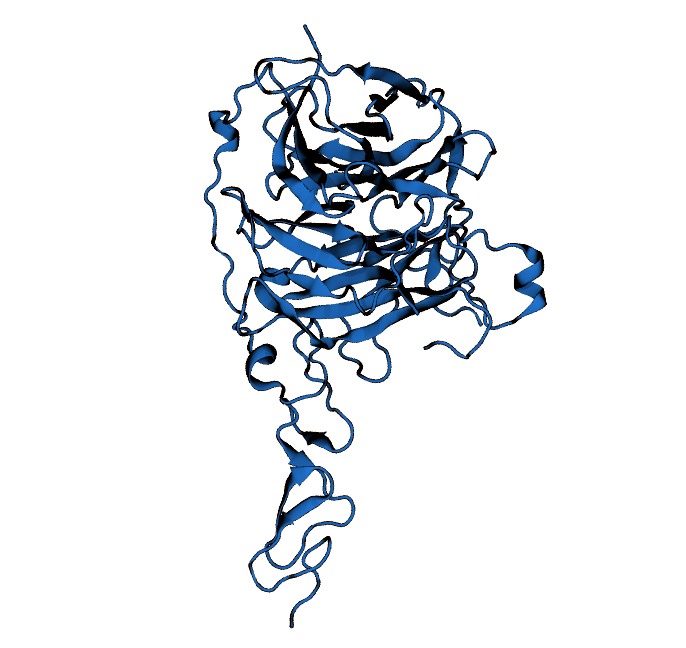

# WHAT ARE THOSE BLUE SQUIGGLES?

Toni and Matteo share a lot of interests. Among these, one of their passions is studying the molecular structure of proteins.
The squiggles you see on each table are artistic representations of different proteins.

## Table 1: Haemoglobin

Responsible for transporting oxygen in our blood, haemoglobin was the first protein Toni ever encountered. For her final high school project, Toni build by hand a 3D model of this protein!

## Table 2: Rhodopsin

Rhodopsin senses light. It is the main reason why we can see, and both Matteo and Toni have studied it in their work.

## Table 3: Heat Shock Protein 90 (HSP90)

HSP90 protectes organisms exposed to high temperatures. Again, coincidence, both Matteo and Toni have studied this class of proteins in their work.

## Table 4: Serum Albumin

Serum Albumin is called "the most romantic of the proteins" because, if you squint, you might notice that it kind of looks like a heart.

## Table 5: Lysozyme

Lysozyme is an enzyme providing innate protection against many pathogens. Every single person working in biophysics started their career looking at this protein!

## Table 6: Sonic Hedgehog

Hedgehog proteins are responsible for regulating the growth of an organism. Proteins of this class all carry names of hedgehogs (indian, brown, ...). Of course we picked Sonic because it is the funniest one!

